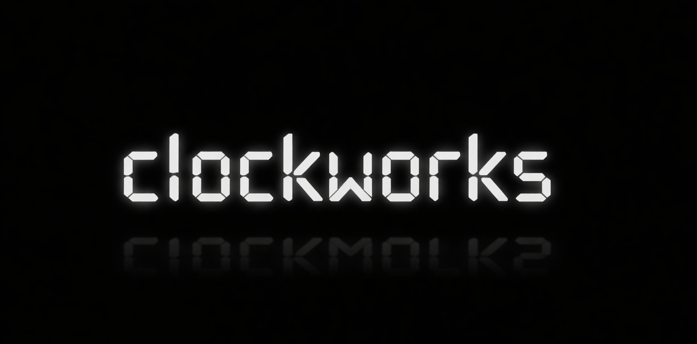

<p align="center">
  
</p>


Clockworks is a .NET library for deterministic, fully controllable time in distributed-system simulations and tests.
It is built around `TimeProvider` so that *time becomes an injectable dependency* you can control (including timers/timeouts), while also providing time-ordered identifiers and causal timestamps.

## Features

- **Deterministic `TimeProvider`**
  - `SimulatedTimeProvider` with controllable wall time (`SetUtcNow`, etc.)
  - Monotonic scheduler time that advances only via `Advance(...)`
  - Deterministic timer ordering and predictable periodic behavior

- **`TimeProvider`-driven timeouts**
  - `Timeouts.CreateTimeout(...)` for a `CancellationTokenSource` cancelled by the provider
  - `Timeouts.CreateTimeoutHandle(...)` for a disposable handle that ties timer lifetime to disposal

- **UUIDv7 generation**
  - `UuidV7Factory` produces RFC 9562 UUIDv7 values as `Guid`
  - Works with real or simulated time
  - Configurable counter overflow behavior

- **Hybrid Logical Clock (HLC)**
  - HLC timestamps and utilities to preserve causality in distributed simulations
  - Helpers to witness remote timestamps and generate outbound timestamps

- **Vector Clock**
  - Full vector clock implementation for exact causality tracking and concurrency detection
  - Performance-first sorted-array representation optimized for sparse clocks
  - `VectorClockCoordinator` for thread-safe clock management across distributed nodes
  - Message header propagation for HTTP/gRPC integration

- **Lightweight instrumentation**
  - Counters for timers, advances, and timeouts useful in simulation/test assertions

## Quick start

### Deterministic timers with simulated time

```csharp
var tp = new SimulatedTimeProvider();

var fired = 0;
using var timer = tp.CreateTimer(_ => fired++, null, TimeSpan.FromSeconds(1), Timeout.InfiniteTimeSpan);

tp.Advance(TimeSpan.FromSeconds(1));
// fired == 1
```

### TimeProvider-driven timeouts

```csharp
var tp = new SimulatedTimeProvider();

using var timeout = Timeouts.CreateTimeoutHandle(tp, TimeSpan.FromSeconds(5));

tp.Advance(TimeSpan.FromSeconds(5));
// timeout.Token.IsCancellationRequested == true
```

### UUIDv7 generation

```csharp
var factory = new UuidV7Factory(TimeProvider.System);
var id = factory.NewGuid();
```

### Vector Clock usage

```csharp
// Create coordinators for two nodes
var nodeA = new VectorClockCoordinator(nodeId: 1);
var nodeB = new VectorClockCoordinator(nodeId: 2);

// Node A sends a message
var clockA = nodeA.BeforeSend();

// Node B receives the message
nodeB.BeforeReceive(clockA);

// Node B sends a reply
var clockB = nodeB.BeforeSend();

// Verify causality
Console.WriteLine(clockA.HappensBefore(clockB)); // true

// Propagate via HTTP headers
var header = new VectorClockMessageHeader(
    clock: clockA,
    correlationId: Guid.NewGuid()
);
var headerString = header.ToString(); // "1:1"
```

## Distributed Systems Support

### Hybrid Logical Clock (HLC)

HLC provides **bounded** causality tracking that stays close to physical time. Best for:
- Systems where wall-clock time matters (e.g., trading systems with time-based SLAs)
- High-throughput systems where O(1) overhead is critical
- Scenarios where approximate causality is sufficient

**Trade-offs:**
- ✅ O(1) space and time complexity
- ✅ Stays close to physical time
- ❌ Cannot detect concurrency (only ordering)
- ❌ Requires synchronized physical clocks for best results

### Vector Clock

Vector clocks provide **exact** causality tracking and concurrency detection. Best for:
- Systems requiring precise happens-before relationships
- Conflict detection in replicated data stores
- Debugging distributed race conditions
- Academic/research scenarios

**Trade-offs:**
- ✅ Exact causality tracking
- ✅ Detects concurrent events (neither happened-before the other)
- ✅ No dependency on physical time
- ❌ O(n) space per clock (where n = number of nodes)
- ❌ O(n) time for merge and compare operations
- ❌ Metadata grows with cluster size

**Example: Detecting concurrency**

```csharp
var coordA = new VectorClockCoordinator(1);
var coordB = new VectorClockCoordinator(2);

// Two nodes generate events independently (no message passing)
var clockA = coordA.BeforeSend();
var clockB = coordB.BeforeSend();

// Vector clocks detect they are concurrent
Console.WriteLine(clockA.IsConcurrentWith(clockB)); // true

// HLC would show one as "less than" the other based on physical time
```

## Demos

### Console demos (`demo/Clockworks.Demo`)

The `demo/Clockworks.Demo` project is a small CLI with multiple focused demos.

List demos:

```bash
dotnet run --project demo/Clockworks.Demo -- list
```

Run a demo:

```bash
dotnet run --project demo/Clockworks.Demo -- uuidv7
```

Useful ones to try:

```bash
# UUIDv7 sortability and time decoding
dotnet run --project demo/Clockworks.Demo -- uuidv7-sortability

# Fast-forwardable timeouts driven by simulated time
dotnet run --project demo/Clockworks.Demo -- timeouts

# Simulated timers, periodic coalescing, and scheduler statistics
dotnet run --project demo/Clockworks.Demo -- simulated-time

# Propagating HLC across service boundaries (header format)
dotnet run --project demo/Clockworks.Demo -- hlc-messaging

# BeforeSend/BeforeReceive workflow with coordinator stats
dotnet run --project demo/Clockworks.Demo -- hlc-coordinator
```

The `uuidv7` demo also has an optional benchmark mode:

```bash
dotnet run --project demo/Clockworks.Demo -- uuidv7 --bench
```

### ASP.NET Core integration demo (`demo/Clockworks.IntegrationDemo`)

`demo/Clockworks.IntegrationDemo` is a minimal ASP.NET Core app that demonstrates a realistic integration:

- SQLite-backed **outbox + inbox** (idempotency)
- An in-memory queued "transport" to keep the demo simple
- Clockworks **HLC propagation** (`HlcCoordinator` + `HlcMessageHeader`)
- A deterministic simulation using `SimulatedTimeProvider`
- Failure injection (drop/duplicate/reorder/delay)

Run it:

```bash
dotnet run --project demo/Clockworks.IntegrationDemo
```

Then POST to `/simulate` (and watch the console trace):

```bash
# Default is simulated time mode
curl -X POST "http://localhost:5000/simulate"

# Run the same simulation under real wall clock time
curl -X POST "http://localhost:5000/simulate?mode=System"

# Tweak knobs
curl -X POST "http://localhost:5000/simulate?mode=Simulated&orders=10&tickMs=5&maxSteps=20000"
```

## Package

- Target framework: `net10.0`
- License: MIT
- Repository: https://github.com/dexcompiler/Clockworks

## Security considerations

### UUIDv7 time exposure

UUIDv7 values **embed a millisecond-resolution timestamp** by design (RFC 9562). As a result, any UUIDv7 generated by
`UuidV7Factory` can be decoded to reveal an approximate creation time, and ordering/rate information can sometimes be inferred
from sequences of IDs.

If you are issuing identifiers across **untrusted/public boundaries** (URLs, externally-visible resource IDs, third-party logs),
do not treat UUIDv7 as opaque. Common mitigations are:

- Use a random UUID (e.g., UUIDv4) for externally-visible identifiers.
- Keep UUIDv7 as an internal primary key, and expose a separate opaque token externally.
- Wrap/encrypt identifiers for external presentation if you need internal ordering but external opacity.

## Notes on determinism

Clockworks is designed so that advancing simulated scheduler time deterministically drives timers/timeouts.
Wall time can be modified independently for clock-skew/rewind simulations.

## Contributing

Issues and PRs are welcome. Please include tests for behavioral changes.
