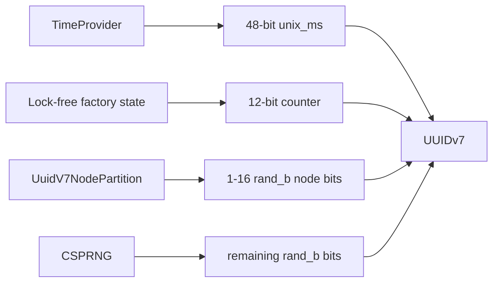

# UUIDv7 Node Partitioning

`UuidV7Factory` defaults to RFC 9562 UUIDv7 with a 48-bit timestamp, a 12-bit monotonic counter in `rand_a`, and 62 effective random bits in `rand_b` after the RFC variant bits. This gives deterministic per-factory ordering and probabilistic cross-factory uniqueness.

Node partitioning is an opt-in distributed mitigation for fleets that can assign stable node, shard, process, or deployment IDs. It reserves the most-significant bits of `rand_b` for that discriminator and leaves the remaining tail bits random.

## Layout

With a 10-bit partition, the high-level layout is:

| Field | Bits | Source |
|---|---:|---|
| `unix_ts_ms` | 48 | Physical/logical time |
| version | 4 | UUIDv7 |
| `rand_a` | 12 | Monotonic counter |
| variant | 2 | RFC variant |
| node partition | 10 | Configured node/shard ID |
| random tail | 52 | CSPRNG bytes |

Clockworks supports 1 to 16 partition bits. A 16-bit partition allows 65,536 configured IDs and leaves 46 random bits in `rand_b`.

## Comparison

| Approach | Strength | Trade-off |
|---|---|---|
| Default `UuidV7Factory` | Fast, simple, 62 random tail bits, strict per-instance ordering | Cross-factory uniqueness is probabilistic; no deterministic namespace separation |
| Node-partitioned `UuidV7Factory` | Deterministic separation between correctly assigned node IDs | Less random entropy; requires correct node/shard assignment |
| `HlcGuidFactory` | Encodes node ID and HLC state for causal/distributed ordering | Different semantics and wire contract; choose it for causal ordering, not just collision mitigation |
| Snowflake-style ID | Compact deterministic allocation with explicit worker bits and sequence | Usually custom format rather than UUID; requires clock discipline and worker coordination |
| Database allocator | Strong central uniqueness and ordering policy | Central dependency, added latency, and availability coupling |

## Failure Modes

Node partitioning does not remove the need for operational discipline:

- Two live nodes configured with the same partition can still collide probabilistically.
- A node ID reused during overlapping deployments is not a unique partition.
- Random entropy is reduced by the configured partition width.
- Storage uniqueness constraints remain the final guardrail for high-assurance domains.

Use node partitioning when you need UUIDv7 compatibility plus deterministic fleet partitioning and can reliably assign non-overlapping IDs.
